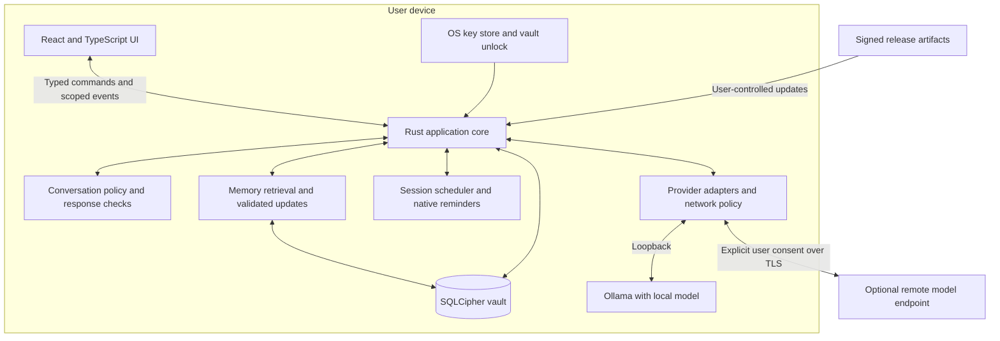
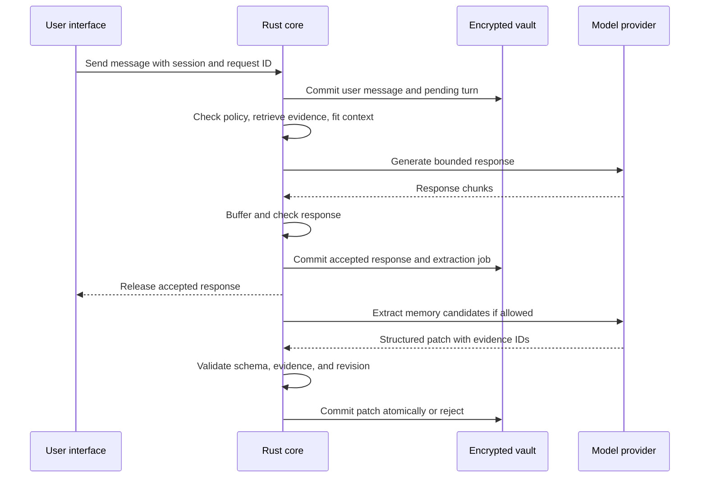

# Architecture

Status: proposed. Read [decisions](decisions.md) for assumptions and [delivery](delivery.md) for the prototype gates.

Openmind should be a desktop application whose Rust backend owns the user's vault, conversation state, provider connections, and memory updates. The React interface displays conversations and asks for narrow operations. A model receives only the context needed for the current task.

## System boundaries



The local runtime is a separate trust boundary even when it runs on the same computer. It sees plaintext prompts and may have its own logging and networking behavior. Openmind has no conversation backend, account service, or required hosted database.

## Proposed stack

| Layer | Choice | Responsibility |
| --- | --- | --- |
| Desktop shell | Tauri 2 | Windows, native commands, menus, dialogs, notifications, packaging, updater |
| Interface | React, TypeScript, Vite | Conversation, session history, memory controls, settings |
| Styling | Tailwind CSS with shared semantic tokens | Implement `DESIGN.md`; accessible headless primitives where useful |
| Frontend tooling | Bun | Dependency management and scripts; not a required runtime on users' machines |
| Application core | Rust, Tokio, Serde, an HTTP client | Typed state transitions, provider streaming, validation, persistence |
| Persistence | SQLite through a SQLCipher-enabled Rust binding | Encrypted chat, memory graph, full-text index, jobs, settings |
| Secret storage | Native key store plus passphrase wrapping | Keys stay out of frontend storage and logs |
| Inference | Ollama adapter plus compatible HTTP adapter | Separate conversation, extraction, and optional embedding capabilities |
| Tests when implemented | Cargo tests, frontend component tests, browser UI tests, native platform smoke tests | Verify behavior at each boundary |

Tauri uses a Rust core and OS webviews. That fits this split, but means macOS and Windows need separate rendering and native integration checks. This is a design recommendation based on [Tauri's architecture](https://v2.tauri.app/concept/architecture/), not a measured performance comparison.

Use a client application built by Vite. There is no need for Next.js server rendering in this desktop product. Keep durable state in Rust. Start with React component state and a small subscription layer for session events. Add Zustand or TanStack Query only if UI coordination or cache behavior warrants them; do not duplicate the vault in a global frontend store.

## Core modules

| Module | Owns | Must not do |
| --- | --- | --- |
| `vault` | Unlock, migrations, transactions, backup, deletion | Return keys or arbitrary SQL access to the webview |
| `sessions` | Session lifecycle, turn IDs, transcript persistence, cancellation | Assume that a network retry is a new user message |
| `providers` | Endpoint config, credentials, capability probes, stream normalization | Change a provider or send history remotely without user action |
| `policy` | Versioned guidance, context limits, input and output checks | Claim perfect detection or clinical expertise |
| `memory` | Evidence, candidate extraction, graph operations, retrieval | Treat an inference as a user-confirmed fact |
| `scheduler` | Recurrence, notification bookkeeping, restart reconciliation | Start an AI conversation while the user is absent |
| `platform` | Key store, notifications, tray, lock/suspend signals | Let the model call native APIs |

Use a modular application in one core process. Extraction is a serialized background job, not a separate agent service. A second process is justified for a future managed inference runtime, not for every internal module.

## Provider contract

Each configuration records `provider_id`, adapter type, base URL, execution location, model identifier or digest where available, secret reference, capability results, and consent version. Never embed credentials in URLs.

Required operations are connection testing, completion generation, and cancellation. Streaming, model discovery, structured output, and embeddings are optional capability flags. Normalize outcomes into connection unavailable, authentication failed, unsupported feature, rate limited, context exceeded, cancelled, and provider failure. Error messages must not echo request bodies or authorization headers.

The compatible adapter speaks the widely implemented `/v1/chat/completions` request format. Ollama documents support for this protocol, but compatibility is partial and differs by operation. Keep an Ollama-native adapter for runtime metadata and native features. Verify roles, streaming frames, context settings, JSON schema behavior, and errors against each supported server. See [Ollama's compatibility documentation](https://docs.ollama.com/api/openai-compatibility).

Do not require tool calling for memory. Ask for a structured candidate patch in a separate extraction call, then validate it in Rust. If a provider cannot reliably return structured data, allow chat with memory updates disabled and explain the limitation. Never silently accept malformed output.

The provider and model are fixed for each turn. Switching requires an explicit action and a new consent check before sending prior history or retrieved memory. Snapshot the provider configuration version when work is queued so a later settings edit cannot reroute an old job.

## Local execution and remote consent

- Default to an explicitly configured loopback endpoint. Do not scan the user's LAN or expose a listening Openmind HTTP service.
- Treat a LAN-hosted model as remote to this device. Require TLS and a deliberate setup flow; it is not equivalent to an on-device model.
- A local address can proxy to a cloud model. Record endpoint location and model execution location separately. If execution cannot be verified, label it unknown rather than claiming offline privacy.
- For Ollama local mode, require a locally available model and guide users to disable cloud features. Ollama documents `OLLAMA_NO_CLOUD=1` and a server configuration option. Openmind must not rewrite a user's existing Ollama configuration without permission. See [Ollama's FAQ](https://docs.ollama.com/faq).
- Remote consent covers the provider host, messages, retrieved memories, extraction, and any embedding requests. Enabling remote chat must not automatically enable remote embeddings or background extraction.
- In local mode, no application-initiated remote requests occur during conversation. Updates and model downloads are separate user actions. Verify this with network monitoring; a third-party server's claims are not proof of its behavior.
- Providers cannot read files, invoke shell commands, browse, or contact people. Model output is data.

## One conversation turn



The first implementation buffers the complete response before display so output review happens before disclosure. Show an honest working state and a stop control. Measure the latency cost. Sentence-level release can be considered later with explicit evaluation of cross-sentence hazards; displaying unreviewed tokens cannot be made safe retroactively. Checks reduce known failure modes and do not guarantee safe outputs.

Persist a user message before inference. If generation fails, leave it in the transcript with a retry state. Use the same logical turn ID on retry and a separate attempt ID, with a unique accepted response per turn. A partial or rejected response never enters the memory source set. Do not rerun remotely on timeout. Cancellation closes the stream and invalidates late callbacks.

A response remains useful even if memory extraction fails. Queue the job with bounded retry and show a subtle memory status. Run at most one generation per profile, prioritize user turns over extraction, and pause background work while locked. No overnight inference by default.

## Context construction

Order context as fixed behavioral policy, explicit user preferences, current session summary, retrieved memories with evidence labels, recent turns, and current user input. Mark quoted material and retrieved text as untrusted content. Never interpolate retrieved text into system policy or tool definitions.

For a validated 8,192-token model configuration, an initial test budget is 1,500 tokens of policy, 1,200 of memory, 3,500 of recent conversation including the current message, 1,200 reserved for output, and 792 for format overhead. These are tunable targets. Verify actual token accounting per adapter; conservative estimates need extra headroom.

Keep the current user turn and fixed policy intact. Trim low-ranked memories and older history first. If the message cannot fit, ask the user to shorten it or select a capable model. Never silently cut away the user's meaning or the policy. Cache summaries with source revisions and invalidate them after edits or deletion.

## Sessions and reminders

Sessions have `open`, `paused`, and `completed` states. A planned session is a calendar intention, not a reservation of the AI. Starting a spontaneous conversation uses the same session engine. Session closure is optional and creates a short summary the user can edit.

Persist recurrence as local wall time, IANA timezone, next UTC occurrence, and a DST policy. Default to following the selected timezone rather than silently following travel. For a nonexistent DST time, move to the next valid time; for a repeated time, notify once. Let users change that behavior explicitly.

The baseline reminder runs while Openmind is open or in its opt-in tray mode. A closed app or sleeping device cannot be assumed to run timers. On startup and wake, reconcile missed occurrences once, without a notification burst. Reliable delivery after full quit requires a verified native scheduling implementation on each platform; do not promise it until tested. Native notifications contain generic text and an opaque session reference, never a life-event summary.

When the vault is locked, model work stops. If reminders remain enabled, a separate minimal OS-protected scheduling cache stores only occurrence times and opaque IDs. The UI explains that reminder timing exists outside the main vault. Lock handling also clears visible conversation state and cancels queued work.

## Planned source layout

The paths below are future implementation structure, not existing runnable files.

```text
src/
  app/                 navigation, providers, window shell
  features/
    conversation/
    sessions/
    memory-controls/
    settings/
  components/          shared accessible UI
  lib/                 typed native client, event subscriptions
src-tauri/
  src/
    vault/
    sessions/
    providers/
    policy/
    memory/
    scheduler/
    platform/
  migrations/
  capabilities/
policies/              versioned guidance and schema definitions
evals/                 synthetic scenarios and expected behavior
docs/
```

Generate or check TypeScript command types from Rust types at the boundary. Initial commands include `unlock_vault`, `start_session`, `send_message`, `cancel_turn`, `list_sessions`, `list_remembered_facts`, `correct_memory`, `forget_topic`, and `configure_provider`. Every command validates locked state, profile ownership, sizes, and IDs. Do not expose `execute_sql`, arbitrary file reads, or a generic tool runner.

Scope events to the active window and session. Include monotonically ordered event numbers and the turn ID so stale chunks cannot land in a new conversation. Clear subscriptions and frontend caches on lock. Tauri capabilities need explicit configuration, including restrictions on custom commands, which are broadly callable by default unless configured. See [Tauri capabilities](https://v2.tauri.app/security/capabilities/).
