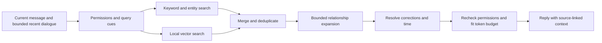

# Local memory and retrieval proposal

September 16, 2026. **Research and engineering recommendation; not implemented or a validated clinical protocol.** This refines [the memory model](memory.md) and [turn processing](turn-processing.md). The UI refinement in this change does not introduce these categories, embeddings, or summaries.

## Recommendation

Keep the existing SQLCipher vault as the source of truth. Add query-aware full-text retrieval first, then local embeddings as a second search channel. Use small source-backed records, dated events, and explicit relationships. Present a small set of overlapping views instead of moving whole sessions into mutually exclusive folders.

A vector is a search aid, not the memory itself. Retain the underlying statement, source, dates, permissions, and corrections. The Rust application selects a bounded context bundle; the model never receives the entire vault or unrestricted database access. More stored history should increase search work, not automatically increase the prompt.

## What works today

Inspection baseline: commit `435ae2a`, the head of PR #3. `main` is `28809e7`; PR #3 adds independent conversation memory/notebook controls and is not merged at the time of this review.

| Area        | Implemented behavior                                                                                                                                                 | Gap                                                                                                                     |
| ----------- | -------------------------------------------------------------------------------------------------------------------------------------------------------------------- | ----------------------------------------------------------------------------------------------------------------------- |
| Storage     | Rust, rusqlite, encrypted SQLCipher vault; schema v4 on PR #3                                                                                                        | No vector or full-text index                                                                                            |
| Extraction  | One structured follow-up call proposes memory and notebook records; exact quotes from the submitted user message; atomic validation/commit                           | No cross-turn entity resolution, event dates, summaries, or relationship graph                                          |
| Retrieval   | `Vault::memory_context` orders corrected records first, then newest records                                                                                          | No query argument, keyword match, or semantic relevance; unrelated recent corrections can displace relevant older facts |
| Context     | `AppEngine::prepare_turn_with_provider` requests at most 1,000 bytes of memory within a 6,000-byte history/input allowance; recent history also has a 20-message cap | These are UTF-8 byte bounds, not tokenizer-aware budgets                                                                |
| Control     | Source-linked correction, source-scoped forgetting, encrypted notebook edits, conversation deletion                                                                  | No topic-wide forgetting or transient private sessions                                                                  |
| Permissions | Per-conversation switches and per-job output permissions; disabling revokes pending output, re-enabling does not backfill                                            | Future transcript indexes must preserve those original permissions                                                      |

Sources in this repository: [vault.rs](../src-tauri/src/vault.rs), [engine.rs](../src-tauri/src/engine.rs), [notes.rs](../src-tauri/src/notes.rs), and [prototype status](prototype.md). The existing proposal already favors SQLite and optional in-process vector search. A second database service is unnecessary at this stage.

## What psychology supports, and what it does not

The reviewed sources do **not** establish a universal set of folders into which every therapeutic conversation should be classified. They describe different aspects of remembering and formulation. The seven views below are our product proposal, informed by those sources, not a psychological standard.

| Source                                                                                                                                    | Relevant finding or framework                                                                             | Design inference for Openmind                                                                                                                           |
| ----------------------------------------------------------------------------------------------------------------------------------------- | --------------------------------------------------------------------------------------------------------- | ------------------------------------------------------------------------------------------------------------------------------------------------------- |
| Conway and Pleydell-Pearce, 2000, [self-memory system](https://pubmed.ncbi.nlm.nih.gov/10789197/)                                         | Autobiographical recollection is constructed from autobiographical knowledge in relation to current goals | Preserve specific episodes and broader context; retrieve according to the current conversation, without pretending the software reproduces human memory |
| Beck Institute, [understanding CBT](https://beckinstitute.org/about/understanding-cbt/)                                                   | Cognitive conceptualization evolves and includes thinking, reactions, strengths, and values               | Keep situations, the person's interpretation, feelings, and actions distinguishable; a reported thought is not an objective fact about the world        |
| Beck Institute, [strength-based conceptualization worksheet](https://beckinstitute.org/wp-content/uploads/2021/08/Strength-Based-CCD.pdf) | Includes life history, resources, strengths, and adaptive beliefs                                         | Remember supports and what helps, rather than accumulating only difficulties; do not reproduce the worksheet as an automatic clinical assessment        |
| SAMHSA, [trauma-informed approaches](https://www.samhsa.gov/mental-health/trauma-violence/trauma-informed-approaches-programs)            | Emphasizes safety, transparency, collaboration, and voice/choice, including resisting retraumatization    | Give the user control over sensitive recall; do not assign a trauma identity or repeatedly resurface painful material because it ranks highly           |

These sources inform organization and interaction. They do not show that this architecture provides effective therapy. Treatment-specific formulation and clinical release criteria remain in [conversation policy](conversation-policy.md).

## Seven overlapping memory views

| View                          | Examples of supported content                                                   | Boundary                                                                              |
| ----------------------------- | ------------------------------------------------------------------------------- | ------------------------------------------------------------------------------------- |
| People and relationships      | Named people, roles, user-described relationship changes                        | Do not merge names by similarity or infer another person's motives                    |
| Events and life context       | Specific episodes, transitions, recurring situations, approximate periods       | Keep when it happened separate from when it was reported                              |
| Self and preferences          | User-described identity, values, communication preferences, boundaries          | No inferred personality profile or immutable identity from a transient feeling        |
| Feelings and responses        | Reported emotions, bodily sensations, thoughts, and actions tied to a situation | Distinguish these facets; preserve negation, uncertainty, and whose experience it is  |
| Concerns and recurring themes | Ongoing difficulties and user-described repetitions                             | A single disclosure does not establish a recurring pattern or diagnosis               |
| Goals and agreed steps        | Desired changes, explicitly accepted actions, completion or abandonment         | Assistant suggestions are not commitments; retain changes over time                   |
| Strengths and support         | Helpful practices, resources, supportive people, things that went well          | Preserve the context in which something helped; no automatic treatment recommendation |

These are saved views over shared records, not seven separate stores or hard routing partitions. One record may appear in several views without duplicating its sensitive content. Use typed facets such as `emotion`, `thought`, `bodily_response`, and `action` within the relevant view. Allow uncategorized supported records; missing or uncertain classification must not erase a useful source.

Do not add a mandatory **Trauma** folder. A user-described traumatic event belongs in events and any other relevant views, with an attributed descriptor and an independent sensitivity/recall preference. Let users set boundaries such as asking before returning to a topic. Enforce an explicit exclusion before search, ranking, context assembly, and generation; a prompt instruction alone is insufficient. Strong negative emotion must not automatically increase retrieval priority.

The existing five `MemoryKind` values remain unchanged in this UI pass. A later additive migration should introduce view memberships separately from record kinds. Existing `person`, `event`, `goal`, `preference`, and `concern` records get conservative default mappings; no invented facts or historical re-extraction during migration.

## Units of memory

Keep the original session intact. Segment its content by meaning and source coverage, not by assigning the entire session to one folder.

1. **Source turns:** authoritative stored user text with immutable IDs and revisions. Assistant output may supply dialogue context but is not evidence of a user's experiences or agreement.
2. **Atomic records:** one modest, supported statement, with typed facets, evidence, dates, and view memberships. Save only useful continuity information; an empty patch is valid.
3. **Episodes:** optional short spans of related turns, preserving both sides of a clarification without blending different speakers' claims. Start evaluating 150–400-token spans with overlap only where needed; these are tuning hypotheses.
4. **Summaries:** optional navigation aids over identified sources. They never replace evidence or become a new independent source of truth. Regenerate from permitted source material rather than repeatedly summarizing prior summaries.

Synthetic example: “On Tuesday I argued with Mira, my sister. I felt tense and went for a walk. It helped. I want to call her this weekend.” This supports a person reference, a dated event (with date uncertainty if needed), the user's emotional response, a reported helpful action, and a goal. It does not establish a traumatic event, an anxiety disorder, a causal theory, or Mira's intentions.

An indirect message such as “She did it again” needs a bounded recent dialogue window for interpretation. Any accepted link must cite the earlier supporting user turn as well as the current turn. When reference resolution is ambiguous, retain the uncertainty or ask; do not guess an identity. Multi-source extraction requires a new validation contract beyond today's exact-current-message quote check.

## Storage and Rust boundaries

Use an incremental schema, not a rewrite of the working vault. The following are logical additions, not migration SQL:

| Record                   | Required data and invariants                                                                                                                                              |
| ------------------------ | ------------------------------------------------------------------------------------------------------------------------------------------------------------------------- |
| Memory record            | Existing ID/revision plus status, optional validity interval, event-date precision, and superseded-by link; user reports and model interpretations remain distinguishable |
| Evidence join            | Memory ID/revision to message ID/revision and checked span; multiple sources allowed; enforce ownership and dependencies                                                  |
| View membership / facets | Record ID, schema version, allowed labels, attribution; no copied content                                                                                                 |
| Entity / relationship    | Stable entity IDs, confirmed aliases, typed edges, source evidence, dates; no default causal or diagnostic edges                                                          |
| Source eligibility       | Turn-level memory/index permission, notebook permission, exclusions and privacy epoch; never derive old permission solely from the current conversation toggle            |
| Search document          | Stable row ID, owner record/revision, permitted text, source dependencies; full-text entries updated transactionally                                                      |
| Embedding                | Search-document ID/revision, model digest, dimensions, preprocessing version, finite vector data, index-generation ID                                                     |
| Derived job              | Source revisions, privacy epoch, permitted outputs, provider/consent version, idempotency key, bounded attempts, queued/running/ready/failed state                        |

Keep persistence and transactions in `vault`; introduce a pure ranking/context module and a separate provider embedding capability as needed. Expose typed operations such as `retrieve_context(query, budget, session_id)` rather than SQL to React or the model. Retrieval should return IDs, evidence labels, dates, and reasons internally; the UI can later show “used these memories” without exposing chain-of-thought.

Start with FTS5 over authorized short statements and verified aliases. Its [official documentation](https://www.sqlite.org/fts5.html) documents ranking and the need to maintain external-content indexes consistently. Verify FTS5 availability in the actual SQLCipher build on both platforms. Update/delete the index and its authoritative content within one transaction; backfill existing eligible records explicitly. Test that old wording disappears after correction, including after restart and rebuild. Do not index all transcripts by default.

Store vectors as BLOBs in the same encrypted database and initially calculate similarity in Rust. [SQLCipher's design](https://www.zetetic.net/sqlcipher/design/) describes encrypted database and journal pages, and the need to avoid file-backed plaintext temporary stores. Audit caches, temporary storage, crash output, and any future extension; an encrypted main database does not make arbitrary sidecar files safe.

For a scaling reference, 10,000 float32 vectors of 768 dimensions occupy about 30.7 MB of raw vector data; 100,000 occupy about 307 MB, before metadata and indexes. These are arithmetic estimates, not latency measurements. Stream or batch scans rather than requiring every vector in RAM. Benchmark before adopting [sqlite-vec](https://alexgarcia.xyz/sqlite-vec/) or another index. Its existence and Rust bindings do not establish compatibility with our SQLCipher build, encryption guarantees, or acceptable latency. A separate vector server adds process, backup, and deletion coordination without a demonstrated need.

## Write and update path

Preserve the two main model calls: stream a reply, then propose paired memory/notebook updates. Validate source support, ownership, allowed types, revisions, and captured permissions before committing. Persist an embedding job in that same transaction. New authorized records become keyword-searchable immediately; a failed embedding job must not lose the record or block chat.

Run embedding work locally, in bounded batches, behind interactive generation. Pause on lock and cancel when a relevant source is forgotten. [Ollama supports batched embeddings](https://docs.ollama.com/capabilities/embeddings); use one fixed model space for query and document vectors. Verify dimensions, normalization, non-finite values, input limits, and truncation behavior. Do not silently truncate a source or compare incompatible vectors.

Select an embedding model by measured recall, latency, memory use, language coverage, redistribution/license constraints, and platform operation. Ollama lists candidate models, but none is selected here. Downloads remain explicit. A remote chat choice does not grant remote embedding consent; no automatic cloud fallback.

On embedding-model changes, build a new index generation without mixing spaces. Keep the compatible old generation active until the replacement is ready, or fall back to lexical retrieval. Correction/deletion invalidates entries in every generation and rejects late job output.

## Retrieval and context assembly

1. **Check eligibility first.** Memory-off disables all saved-memory channels, summaries, profile preferences derived from history, and cross-session transcript fallback. The current conversation's permitted recent transcript remains available under existing semantics. Exclude forgotten, deleted, superseded-for-current-use, and restricted records before candidate selection; recheck after expansion and before dispatch.
2. **Build query cues.** Use the current message plus a small permitted recent window to resolve references, names, and dates. Explicit date/person constraints can filter results; inferred category labels are soft hints. Always retain a cross-category search channel. Never fabricate an exact date from vague language.
3. **Retrieve independently.** Initial experiments: top 20 lexical and top 20 vector results over the eligible corpus, plus bounded exact-entity matches. Do not limit the vector scan to the newest records or only lexical matches: that would defeat recall of old facts and paraphrases. No embeddings available means a usable lexical path.
4. **Fuse ranks.** Start with [reciprocal rank fusion](https://research.google/pubs/reciprocal-rank-fusion-outperforms-condorcet-and-individual-rank-learning-methods/), rather than directly adding incompatible BM25 and cosine scores. Deduplicate shared source content. Record method/version for synthetic evaluations. Candidate counts and fusion constants require tuning.
5. **Expand cautiously.** First evaluate one-hop links from the best seeds and cap the total candidate set at 40. Only add a second hop if multi-session cases demonstrably need it. These limits refine the earlier two-hop proposal in `memory.md`.
6. **Respect time and corrections.** Relevant user corrections replace superseded wording. Do not let every unrelated correction outrank every relevant record. Distinguish a changed life circumstance from a correction to an earlier error. Retain dated alternatives when answering a historical question; don't treat them as simultaneously current facts. Stable preferences should not decay simply with age.
7. **Pack whole evidence units.** Reserve policy, the current message, response allowance, and provider framing before assigning memory/history budgets. Count with the actual model tokenizer where available; use a measured conservative fallback otherwise. Drop low-value units rather than cutting negations or source labels. The older 8,192-token proposal is a test configuration, not proof every provider fits it. Current code still uses its byte cap.
8. **Allow no result.** Similarity is not truth or sufficient relevance. Calibrate thresholds on held-out queries and evaluate unsupported recall. Ask a targeted clarification or acknowledge missing context rather than fill the prompt with vaguely related painful experiences.

An optional transcript fallback should be a separately evaluated later capability. It must search only originally eligible source spans and respect corrections, exclusions, and sensitive-recall preferences. Re-enabling memory must not index messages written while memory was off. If legacy eligibility cannot be established, leave those transcripts out. This prevents a new index from silently changing the meaning of the existing controls.

## Correction, forgetting, and race handling

Keep today's source-scoped Forget wording until broader semantics actually work. A correction should immediately invalidate stale index entries and summaries; its original quote remains attributed as original evidence, not proof of the corrected statement. User corrections and confirmed aliases are authoritative over older generated interpretations.

For future multi-source records, compute the dependency closure before deletion. Drop affected records, full-text entries, vectors, summaries, edges, and queued jobs transactionally. Rebuild mixed-source records only from still-permitted evidence. Preview effects on edited notebook entries before the user's deletion action. Keep minimal content-free tombstones/exclusions and a monotonically increasing privacy epoch. A stale embedding or extraction result cannot commit after that epoch changes.

At provider dispatch, validate the context snapshot against the current privacy epoch; cancel active work on forgetting or locking. Already-sent plaintext cannot be recalled from a provider. Backups remain a separate deletion boundary. Do not retain sensitive duplicate text in job payloads, diagnostic logs, or audit records.

## Evaluation before choosing complexity

[LongMemEval](https://arxiv.org/abs/2410.10813) evaluates extraction, multi-session reasoning, temporal reasoning, updates, and abstention; its results motivate testing more than simple similarity lookup. It is an engineering benchmark, not evidence of clinical effectiveness. Use its task distinctions alongside a separately authored synthetic Openmind suite. Do not commit real sessions or copy third-party datasets without checking their terms.

Compare the current corrected/recency baseline, keyword-only, vector-only, hybrid, and hybrid plus links using identical sources and final context budgets. Freeze extraction for retrieval comparisons; separately evaluate end-to-end extraction errors. Use held-out people/scenarios, record model digests, and inspect false positives as well as averages.

| Gate                          | Proposed check                                                                                                                                                                                               |
| ----------------------------- | ------------------------------------------------------------------------------------------------------------------------------------------------------------------------------------------------------------ |
| Evidence and retrieval        | Retain `memory.md` targets: human-review at least 200 extracted candidates for support and 100 annotated continuity questions; measure recall within the final packed budget and irrelevant selected records |
| Permissions/deletion          | Zero forbidden or forgotten source inclusion and zero stale commits in deterministic race/restart/reindex tests; pass across all retrieval paths                                                             |
| Time and identity             | Same-name people, old versus current goals, explicit corrections, approximate dates, pronouns, multiple sources, and user/assistant attribution                                                              |
| Abstention and interpretation | Unanswerable queries, contradictory accounts, sarcasm, hypotheticals, a thought mistaken for a fact, and one negative experience mistaken for trauma or a pattern                                            |
| Support balance               | Strengths, useful routines, changed preferences, and positive episodes; no default boost for distress or old risk-related disclosures                                                                        |
| Scale                         | Synthetic 1k/10k/100k records on nominated Windows and macOS hardware; record p50/p95 search, query embedding, total retrieval, RAM, index size, and cold/warm behavior separately                           |
| Performance hypothesis        | Start with a 200 ms p95 local-search target excluding query embedding, and measure total retrieval against a 1 s warm target; revise from hardware evidence, not promises                                    |
| Prompt robustness             | Retrieved instructions remain untrusted data; multi-byte text fits budgets; all indexed sources retain attribution and useful date context                                                                   |

These are proposed gates, not achieved results. Clinical behavior evaluation remains separate and requires appropriate expertise.

## Delivery order

1. **Query-aware baseline:** isolate retrieval/context assembly, introduce typed source references and eligibility checks, then add encrypted FTS5. Demonstrate relevant old-memory recall and deletion/correction consistency against the current baseline.
2. **Local semantic retrieval:** embedding capability, durable revision-checked jobs, vector BLOBs, exact similarity scan, hybrid fusion, and no-model fallback. Benchmark representative vault sizes before adding an extension.
3. **Temporal and relational memory:** additive evidence joins, event time, conservative entities, supersession, and the seven overlapping views. Extend extraction only with source-validation tests and human-reviewed synthetic examples.
4. **Long-history support:** permission-aware episode indexing and invalidatable summaries, then measured graph expansion or approximate indexing if needed. Preserve all controls during migration and interrupted rebuilds.

The next implementation should be step 1. This change documents the proposal and refines the existing UI; it does not authorize or claim completion of the remaining memory milestones.
